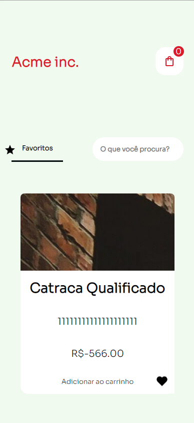
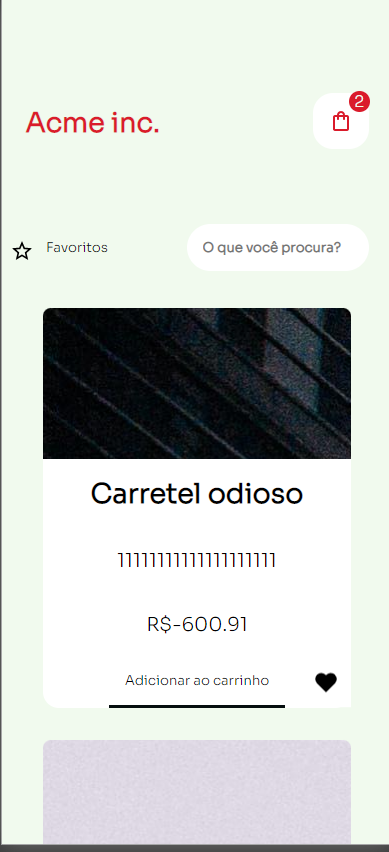
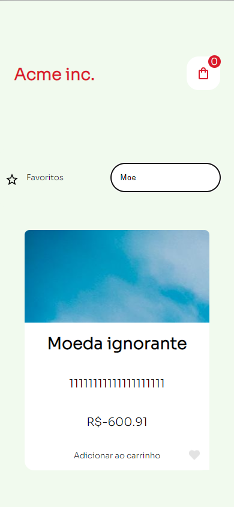
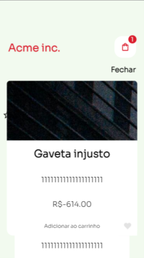
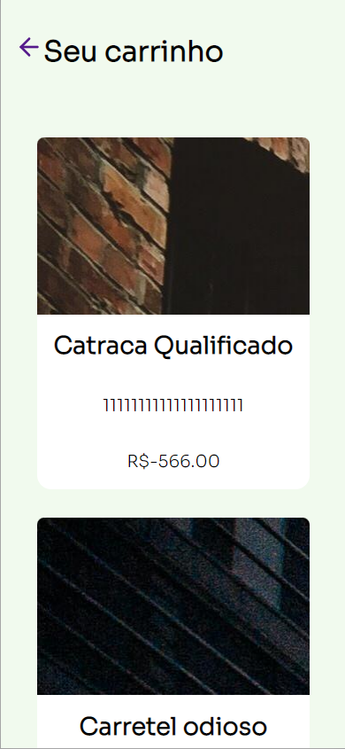
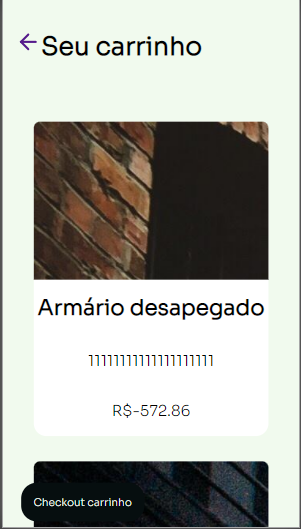
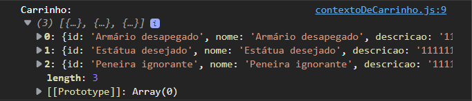

<h1 align="left">ACME inc desafio</h1>

## Sobre

Desafio proposto pela Hype 🏢 para simular um web app de um e-commerce para nossa queria acme :D

## Tecnologias

- **ReactJS**: Para componentizar
- **StyledComponents**: Para estilizar os componentes, bem como controlar comportamentos de estilos dos mesmos
- **Cypress**: Para desenvolver teste E2E
- **React-router-dom**: Para mapear as rotas de carrinho e homepage
- **Create-react-app**: Para estruturar nosso projeto

## Screenshots

É possível favoritar e filtrar seus favoritos

É possível filtrar pelo nome do produto, inclusive com o filtro de favoritos

Também é possível abrir os detalhes do produto, basta clicar na imagem do produto que quer ver
Para fechar o detalhe do seu produto, clique em fechar.

Ao final, você tem seu carrinho, que pode ser tanto adicionado em seu localstorage, quanto excluido de lá 🥇

Na página de carrinho, você pode realizar o checkout dele, em checkout do carrinho, pelo console do navegador `shift F12` é possível ver os dados do carrinho que foi dado o checkout

## Do que você vai precisar

- Instalar o [NodeJS](https://nodejs.org/en/) e com ele o npm (node package manager)
- Instalar o [Git](https://git-scm.com/book/pt-br/v2/Come%C3%A7ando-Instalando-o-Git)

## Como executar

Clone este repositório com `git clone https://github.com/JeanMenezees/desafio-hype.git`

Execute em seu terminal  `npm start`

Acesse a aplicação em http://localhost:3000/
